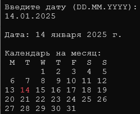

Напишите функцию, которой подается дата и функция выводит в консоль календарь на месяц по семь дат в строку. При этом расположение чисел должно соответствовать дням недели. Также необходимо правильно выровнять числа.

Пример интерфейса работающей программы (выделение цветом текущего дня делать не обязательно).

 